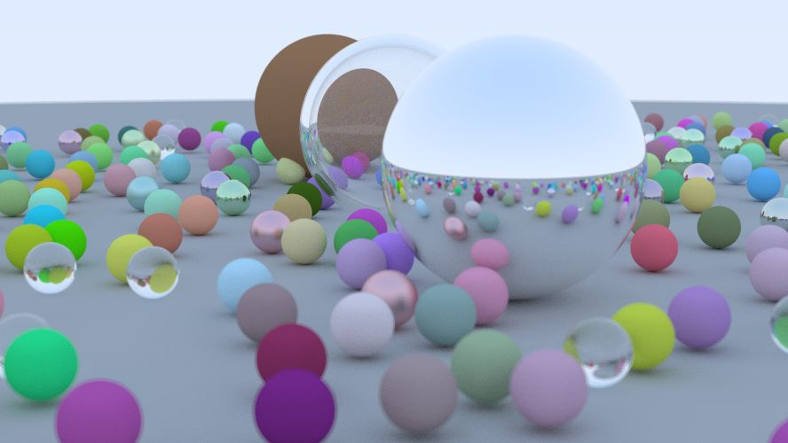

# LearnRayTracing
A repository for learning ray tracing.

## Ray Tracing in One Weekend

> 别人的 One Weekend，我的 Half Year。。。

## Ray Tracing: The Next Week

> 新增了配置文件方便调试

> 一些优化
>
> - BVH：复杂场景330+s -> 90左右s
> - 线程池：90s -> 65s

