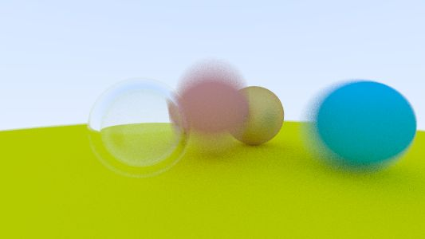
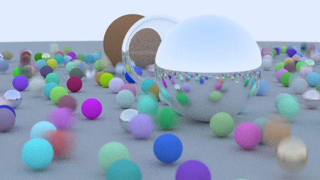
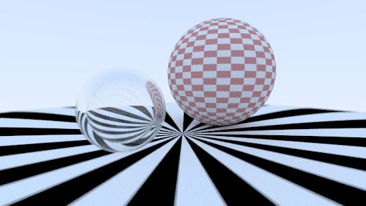
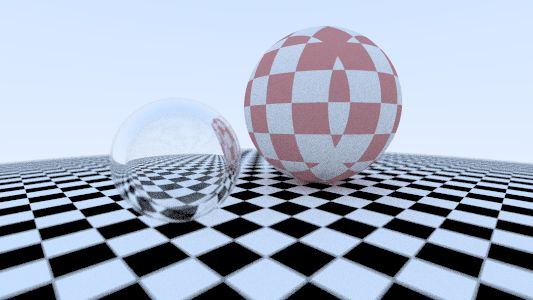

## Ray Tracing: The Next Week

> 新增了配置文件方便调试

> 一些优化
>
> - BVH：复杂场景330+s -> 90左右s
> - 线程池：90s -> 65s

>遗留问题
>
>- 棋盘纹理
>
>  想做到均匀分布到球面上，使用球坐标映射到UV的方法，会存在球顶部辐射状问题，使用映射到立方体的方法，立方体边界也存在问题
>
>  
>
>- -